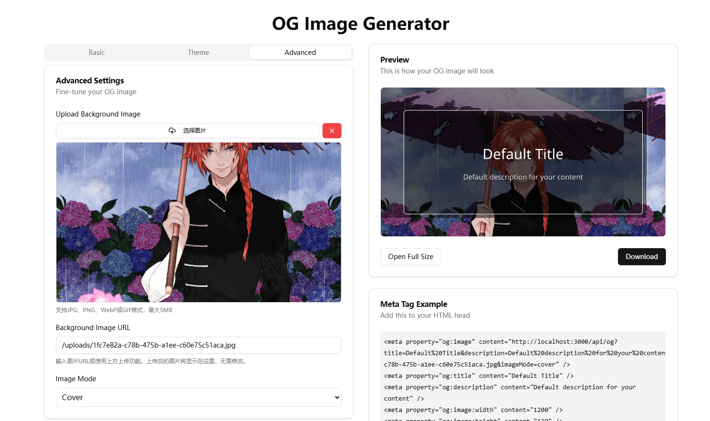

# OG 图像生成器

这是一个基于 Next.js 构建的 Open Graph (OG) 图像生成器，可以帮助你为网站或应用创建自定义的社交媒体分享卡片。使用全新的 shadcn/ui 组件库，提供美观、现代的用户界面。



## 功能特点

- 🎨 自定义图像标题和描述
- 🖼️ 支持上传自定义背景图片或使用URL
- 📤 内置图片上传功能，无需外部主机
- 🌈 提供14种多样化主题颜色选择
- 🎭 支持通过调色盘自定义选取颜色
- 🔤 提供多种字体样式选择
- 📐 背景图片多种显示模式(覆盖、包含、重复、居中)
- 📋 一键复制meta标签，轻松集成到网站
- 📱 响应式设计，适配各种设备
- 🔗 便捷的链接复制功能
- 💾 一键下载生成的图像
- 🌓 明暗主题支持
- ⚡ 基于Edge Runtime的高性能图像生成
- 🧩 组件化设计，易于扩展

## 技术栈

- [Next.js 15](https://nextjs.org/) - React框架
- [Tailwind CSS](https://tailwindcss.com/) - 样式
- [shadcn/ui](https://ui.shadcn.com/) - 美观的UI组件
- [@vercel/og](https://vercel.com/docs/functions/og-image-generation) - OG图像生成
- [Satori](https://github.com/vercel/satori) - HTML/CSS 到 SVG 转换
- [Sharp](https://sharp.pixelplumbing.com/) - 高性能图像处理

## 开始使用

### 安装依赖

```bash
npm install
# 或
yarn
# 或
pnpm install
```

### 开发环境运行

```bash
npm run dev
# 或
yarn dev
# 或
pnpm dev
```

打开 [http://localhost:3000](http://localhost:3000) 查看应用。

## 使用指南

### 基本配置

1. 在"基本"选项卡中设置标题和描述
2. 选择合适的字体样式（无衬线、衬线、等宽等）
3. 预览右侧实时更新的OG图像

### 主题设置

1. 在"主题"选项卡中选择预设主题（light、dark、blue等）
2. 如果选择"custom"主题，可以使用颜色选择器自定义：
   - 背景颜色
   - 文字颜色
   - 强调色（边框颜色）
3. 选择器支持直接拾取颜色或输入十六进制代码

### 高级设置

1. 在"高级"选项卡中上传背景图片或设置背景图片URL：
   - **直接上传**：点击"选择图片"按钮上传JPG、PNG、WebP或GIF格式的图片（最大5MB）
   - **使用URL**：在背景图片URL输入框中输入公开可访问的图片URL
2. 选择背景图片的显示模式：
   - **覆盖 (cover)** - 图片将缩放以填满整个区域，可能会被裁剪
   - **包含 (contain)** - 图片将完整显示在区域内，可能有空白
   - **重复 (repeat)** - 图片将以原始大小平铺重复
   - **居中 (center)** - 图片将以原始大小居中显示

### 使用生成的图像

1. 在预览区下方可以直接复制OG图像URL
2. 或者复制完整的meta标签代码片段，直接粘贴到网站的`<head>`中
3. 还可以下载生成的图像用于其他用途

```html
<!-- 示例meta标签 -->
<meta property="og:image" content="https://your-domain.com/api/og?title=Your%20Title&description=Your%20Description&theme=light&font=sans" />
<meta property="og:title" content="Your Title" />
<meta property="og:description" content="Your Description" />
<meta property="og:image:width" content="1200" />
<meta property="og:image:height" content="630" />
<meta name="twitter:card" content="summary_large_image" />
<meta name="twitter:image" content="https://your-domain.com/api/og?title=Your%20Title&description=Your%20Description&theme=light&font=sans" />
```

### 字体选择

提供以下五种字体风格选择：

- **sans** (无衬线) - 现代简洁风格，适合大多数内容
- **serif** (衬线) - 传统优雅风格，适合正式内容
- **mono** (等宽) - 技术风格，适合代码或技术内容
- **cursive** (草书) - 手写风格，适合艺术或创意内容
- **fantasy** (装饰) - 独特装饰风格，适合特殊场合

### 主题颜色

应用提供多种预设主题，分类为：

- **基础主题**: light, dark
- **彩色主题**: blue, green, red, purple, orange, pink
- **强调色主题**: teal, brown, cyan, amber, indigo, lime
- **渐变主题**: sunset, ocean, forest, passion
- **自定义主题**: 可以完全自定义背景、文字和强调色

## 图片上传

应用提供了内置的图片上传功能，无需依赖外部图床：

- **支持格式**：JPG、PNG、WebP和GIF
- **文件大小限制**：最大5MB
- **存储位置**：上传的图片保存在`public/uploads`目录下
- **文件命名**：使用UUID生成唯一文件名，避免冲突
- **预览功能**：上传后立即显示图片预览
- **清除功能**：可以一键清除已上传的图片

## API 参考

OG图像生成API接受以下查询参数：

| 参数 | 描述 | 可选值 | 默认值 |
|------|------|--------|-------|
| `title` | 图像标题文本 | 任意文本 | "Default Title" |
| `description` | 图像描述文本 | 任意文本 | "Default description for your content" |
| `theme` | 主题选择 | light, dark, blue, green, red, purple, orange, pink, teal, brown, cyan, amber, indigo, lime, sunset, ocean, forest, passion, custom | "light" |
| `font` | 字体选择 | sans, serif, mono, cursive, fantasy | "sans" |
| `backgroundImage` | 背景图片URL | 有效的图片URL | - |
| `imageMode` | 背景图片显示模式 | cover, contain, repeat, center | "cover" |
| `bgColor` | 自定义背景颜色（十六进制） | #RRGGBB | - |
| `textColor` | 自定义文字颜色（十六进制） | #RRGGBB | - |
| `accentColor` | 自定义边框颜色（十六进制） | #RRGGBB | - |

> 注意: `bgColor`, `textColor`, 和 `accentColor` 仅当 `theme=custom` 时有效。

### 示例请求

基本请求:
```
/api/og?title=Hello%20World&description=Welcome%20to%20my%20website
```

自定义主题:
```
/api/og?title=Hello%20World&description=Welcome%20to%20my%20website&theme=custom&bgColor=%23FF5733&textColor=%23FFFFFF&accentColor=%23FFD700
```

带背景图片:
```
/api/og?title=Hello%20World&description=Welcome%20to%20my%20website&backgroundImage=https://example.com/my-image.jpg&imageMode=contain
```

## 图像设计细节

- **尺寸**: 1200 x 630 像素（标准OG图像尺寸）
- **内容区**: 中央区域带有边框，确保文字清晰可读
- **标题**: 大号加粗字体，居中显示
- **描述**: 中等大小字体，居中显示
- **背景图片**: 如果提供，将根据指定的显示模式进行处理
- **叠加层**: 背景图片上会自动添加半透明叠加层，确保文字可读性

## 自定义开发

### 修改UI组件

项目使用shadcn/ui组件库，UI组件位于`src/components/ui`目录。可以修改这些组件来自定义应用外观。

### 修改OG图像生成逻辑

OG图像生成的核心逻辑位于以下文件:

- `src/app/api/og/route.tsx` - 处理API请求并渲染OG图像
- `src/app/api/og/styles.ts` - 定义OG图像的样式逻辑
- `src/app/api/og/utils.ts` - 提供工具函数，如主题处理
- `src/app/api/og/constants.ts` - 定义主题和字体常量
- `src/app/api/og/types.ts` - 定义类型接口

### 修改图片上传功能

图片上传功能的核心逻辑位于以下文件:

- `src/app/api/upload/route.ts` - 处理图片上传请求
- `src/components/ui/file-upload.tsx` - 文件上传UI组件

如需修改上传功能，可以编辑这些文件，例如：
- 调整支持的文件类型
- 修改文件大小限制
- 更改文件存储路径
- 添加图片处理逻辑（如压缩、裁剪等）

### 添加新主题

要添加新的主题，编辑`src/app/api/og/constants.ts`文件，在`themes`对象中添加新的主题定义。

## 部署

该项目可以轻松部署到Vercel平台：

[](https://vercel.com/new/clone?repository-url=https%3A%2F%2Fgithub.com%2Fyourusername%2Fog-image-generator)

1. 点击上方按钮或手动导入到Vercel
2. 无需额外配置，默认设置即可正常运行
3. 部署完成后，你将获得一个可用的OG图像生成服务

### 部署注意事项

当部署到生产环境时：

1. **上传目录**: 确保`public/uploads`目录存在，该目录用于存储上传的图片
2. **持久化存储**: 在Vercel或其他无状态部署平台上，应考虑使用外部存储服务（如AWS S3、Cloudinary等）替代本地文件系统存储
3. **环境变量**: 可以添加环境变量来配置最大文件大小、允许的文件类型等

## 性能考虑

- OG图像生成使用Edge Runtime，提供低延迟响应
- 对于需要高流量的场景，建议:
  - 考虑缓存策略
  - 限制自定义背景图片大小
  - 监控API使用情况
  - 使用CDN缓存上传的图片

## 浏览器兼容性

应用UI支持所有现代浏览器，包括:
- Chrome / Edge (最新版)
- Firefox (最新版)
- Safari (最新版)
- 移动浏览器

## 许可证

MIT
